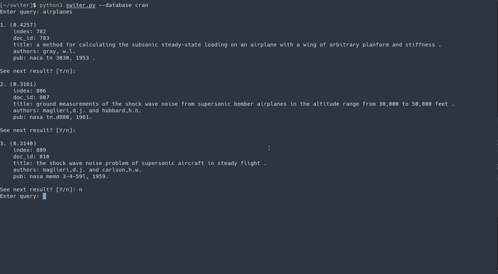
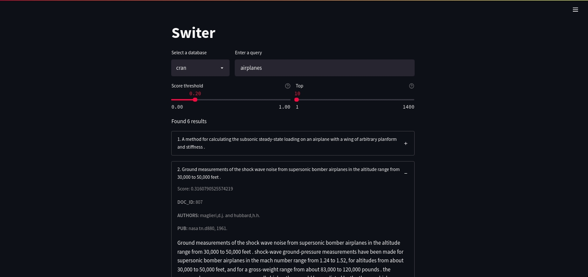

# Switer

Switer (*Swift Text Retrieval*) es un CLI desarrollado en `typer` realizado como
proyecto final de la asignatura Sistemas de Recuperación de Información
(Ciencias de la computación, Universidad de la Habana). Permite la creación de
modelos vectoriales (TF-IDF) de recuperación de información de texto para
diversas bases de datos.

## Índice

1. [Vista previa](https://github.com/Robegr42/SRI-project#vista-previa)
2. [Inicio rápido](https://github.com/Robegr42/SRI-project#inicio-r%C3%A1pido)
3. [Cómo instalar dependencias ncesesarias](https://github.com/Robegr42/SRI-project#c%C3%B3mo-instalar-dependencias-ncesesarias)
4. [Cómo ejecutar el programa](https://github.com/Robegr42/SRI-project#c%C3%B3mo-ejecutar-el-programa)
5. [Comandos disponibles](https://github.com/Robegr42/SRI-project#comandos-disponibles)
6. [Cómo añadir una base de datos nueva](https://github.com/Robegr42/SRI-project#c%C3%B3mo-a%C3%B1adir-una-base-de-datos-nueva)
7. [Construcción del modelo](https://github.com/Robegr42/SRI-project#construcci%C3%B3n-del-modelo)
8. [Evaluación](https://github.com/Robegr42/SRI-project#evaluaci%C3%B3n)
9. [Abrir Switer desde streamlit](https://github.com/Robegr42/SRI-project#abrir-switer-desde-streamlit)

## Vista previa

CLI:



Aplicación web:



## Inicio rápido

```shell
# Instalar dependencias
pip install -r requirements.txt
# Construir base de datos Cran
python switer.py build-db cran
# Construir el modelo para la base de datos Cran usando una configuración
python switer.py build-model cran --config adv_config.json
# Comenzar a realizar consultas sobre la base de datos de Cran
python switer.py --databse cran
# Opcional: Evaluar el modelo de Cran
python switer.py evaluate cran
```

## Cómo instalar dependencias ncesesarias

```shell
pip install -r requirements.txt
```

## Cómo ejecutar el programa

```sh
python switer.py
```

Con el argumento `--help` se puede ver la ayuda del programa.
```sh
python switer.py --help
```

## Comandos disponibles

La aplicación consta de 3 comandos: `continuous` (permite realizar varias
consultas), `single` (procesa una sola consulta) y `evaluate` (prueba la
capacidad del modelo implementado). Si no se especifica uno de estos comandos,
se ejecuta el comando `continuous` por defecto.

De forma adicional se puede ver la ayuda de cada uno de estos comandos:
```sh
python switer.py continuous --help
python switer.py single --help
python switer.py evaluate --help
```

## Cómo añadir una base de datos nueva

Para que la apliación pueda indexar y usar una base de datos deben existir
los siquientes archivos:

```text
./database
|__ /[nombre de la base de datos]
   |__ docs.json
   |__ metadata.json
```

> Ejemplo:
> ```text
> ./database
> |__ /cran
>    |__ docs.json
>    |__ metadata.json
> ```

El archivo `docs.json` es una lista que contiene en cada posición el texto de un
documento.

El archivo `metadata.json` es una lista de diccionarios con los metadatos de cada
documento. Cuando una consulta es realizada el resultado obtenido contiene los
metadatos de los archivos relevantes.

La creación de una base de datos puede automatizarse con el uso de la clase
`DatabaseBuilder` mediante el método estático `DatabaseBuilder.build()`. Este
método recibe el nombre de la base de datos a crear, los metadatos y los
documentos. Con estos elementos luego se crea la estructura necesaria y se
guarda cada archivo donde debe ir.

Luego de añadir una base de datos es necesario crear el modelo que se usará
para realizar consultas sobre ella (de esta forma no hay que recalcular todo en
cada consulta). Esta operación puede tomar un poco de tiempo y se puede realizar
ejecutando el comando:

```shell
python switer.py build-model [db_name]
```

Finalmente para realizar búsquedas sobre la base de datos añadida es solo
ejecutar:

```shell
python switer.py --database [db_name]
```

## Construcción del modelo

Para la construcción de un modelo a partir de una base de datos ya creada se utiliza
el comando `build` de la siguiente forma:

```shell
python switer.py build-model [db_name]
```

A este comando (de forma opcional) se le puede asignar un archivo de
configuración que definirá cómo se construirá el modelo:

```shell
python switer.py build-model [db_name] -c [config_file]
python switer.py build-model [db_name] --config [config_file]
```

> Ejemplo:
> ```shell
> python switer.py build cran -c config.json
> ```

Se puede generar un archivo de configuración por defecto con el comando:

```shell
python switer.py gen-config
```

> La configuración que genera el comando anterior el que se usa si no se
> especifica ningun archivo.

Para una descripción más detallada de las diferentes configuraciones:

```shell
python switer.py gen-config --help
```

## Evaluación

Para evaluar un modelo de una base de datos:

```shell
python switer.py evaluate [nombre]
```

> Ejemplo:
> ```shell
> python switer.py evaluate cran
> ```

Si el modelo de la base de datos cambia entonces el comando anterior realizará
otra evaluación, en caso contrario, se cargará la ultima evaluación hecha para
el modelo existente.

Si se quieren realizar comparaciones de las métricas entre todas las evaluaciones
hechas se usa el comando `--compare` (o `-cm`):

```shell
python switer.py evaluate [nombre] -cm
```

También se pueden construir varios modelos usando varios archivos de configuración
y evaluarlos en un solo comando usando la opción `--configs` (o `-cf`):

```shell
python switer.py evaluate [nombre] -cf config.json -cf adv_config.json
```

## Abrir Switer desde streamlit

En caso de no tener streamlit:

```shell
pip install streamlit
```

Para ejecutar la aplicación:

```shell
streamlit run sl_app.py
```
